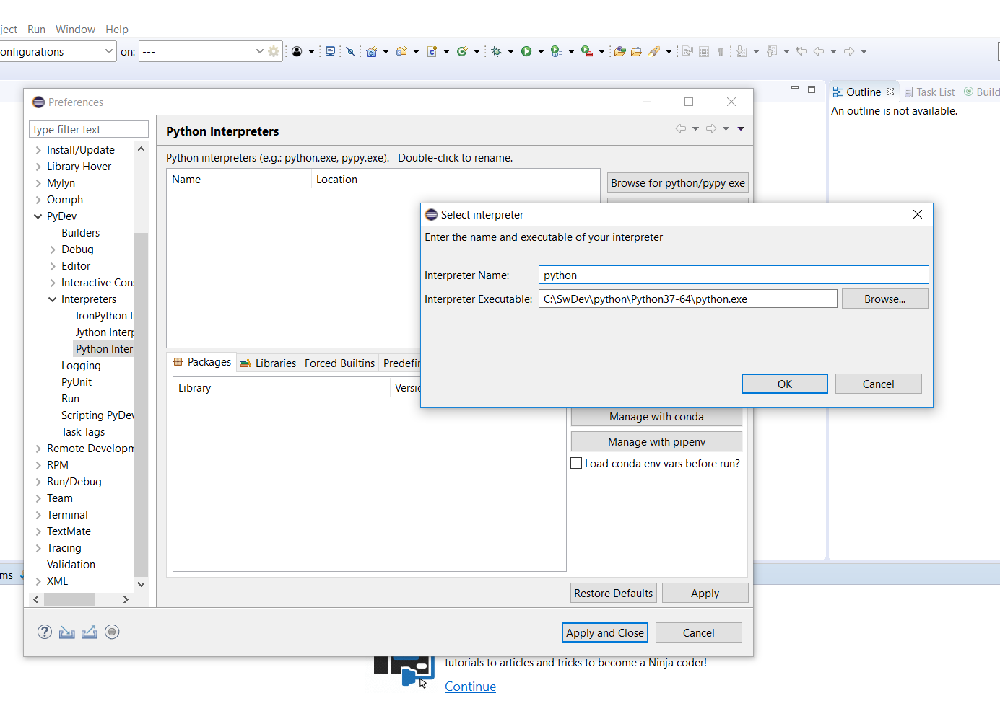

# Setting up a python IDE # 

## Preferred folder structure for python projects ##

Switch to custom installing and use the intended folder. If you just use eclipse wit PyDev for python  development, there is no need to take care about windows environmental variables. The IDE will take care about environmental variables like PATH, PYTHONPATH and PY_HOME.

```
JRE installed within windows standard pathes

C:\SwDev	(root folder)
		\python
				\Python37-64	(python example interpreter)
		\eclipse	(python IDE)
		\eclipse_workspace	(eclipse specific workspace)
		\git	(git specific workspace)
			\PythonProject	(python example project)
							\src
							\doc
							\img
```
	

## installation of eclipse ##
JRE and Eclipse have to fit to gather (e.g. 64 bit and version), python environment can be of any version.

## download and install jre ##
Eclipse is developed with Java therefore the latest JRE (Java Runtime Environment) is needed.


## download and install eclipse ## 


## download and install python ##
Select the required version, currently I prefer the latest 64bit version. But this depends on packages you want/have to use.


## download and install eclipse python packages ##
1. go to Menu "Help>Eclipse Market Place" and search for PyDev
1. restart eclipse
1. go to Menu "Help>Eclipse Market Place" and search for CodeMix

## engage pydev with python
1. go to menu "Window>Preferences"
1. go to sub menu "PyDev>Interpreters>Python Interpreter"
1. add python.exe of required interpreter (see screenshot below)




